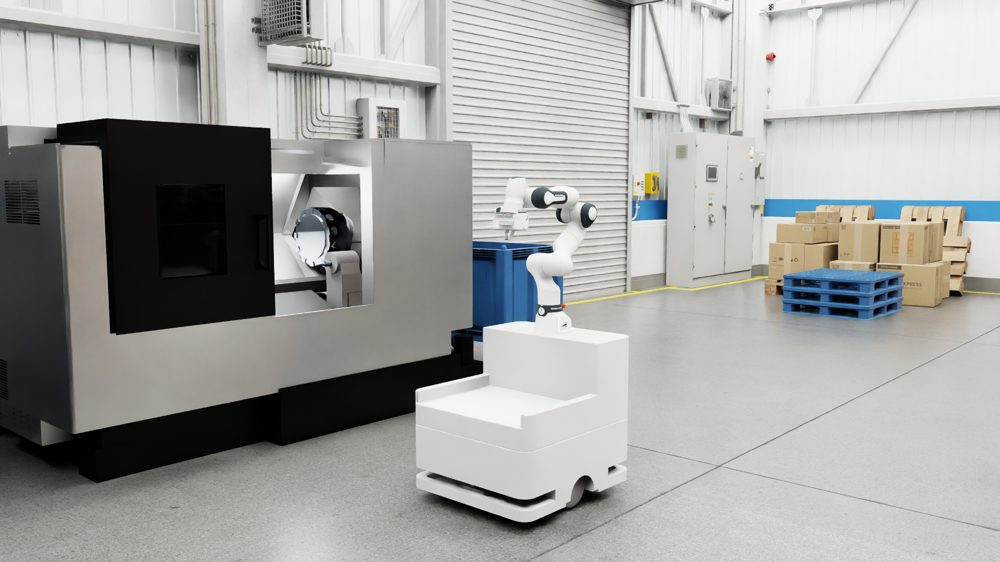

# 🍈 Melon Robot with Isaac Sim and ROS2 Humble



このリポジトリには、モバイルマニピュレータ**Melon**をROS2 HumbleとIsaac Sim 5.0.0環境でシミュレーションするためのROS2パッケージとUSDファイルのダウンロードスクリプト、Melonのデモコードが含まれています。<br>


## 🎯 概要

**Melon**は、モバイルマニピュレータロボットです。このプロジェクトでは以下の機能を提供します：

- **ROS2 Humbleベースの制御システム**
- **MoveIt!によるアーム軌道計画**
- **Navigation2による自律移動**
- **Behavior Treeを使用したタスク実行**
- **Isaac Sim とのシームレスな連携**

## 🚀 インストール

### 1. Isaac Sim環境の準備

Isaac Simは[isaacsim-commonリポジトリ](https://github.com/momoiorg-repository/sim-common)を使用してセットアップしてください<br>
USDのダウンロードなどもこちらのリポジトリを参照してください。

### 2. リポジトリのクローン

```bash
git clone https://github.com/SSatoya/melon_ros2.git
cd melon_ros2
```

### 3. ROS2環境設定
環境変数を設定するために`.env`ファイルを編集：

```bash
# .envファイルの設定例
ROS_DOMAIN_ID=80                    # ROSドメインID
CONTAINER_NAME=melon_ros2_app  # コンテナ名
```

### 4. Dockerコンテナのビルドと起動

以下のスクリプトを実行することで **イメージ作成** → **コンテナ作成** → **接続** まで一括実行できます。

```bash
./build.sh
```
コンテナ内に接続されたら、表示に従って初期設定を行ってください。<br>

- 初回のみ上記スクリプトを実行してください
- 2回目以降は以下で直接接続できます：

```bash
docker start <your container name>
docker exec -it <your container name> bash
```

## 🤖 使用方法

### Isaac Simとの連携

1. Isaac Simでシミュレーション環境を開始
2. ROS2ブリッジで通信開始
3. 各種制御パッケージを起動

### MoveIt!による動作計画

アーム制御のためのMoveIt!起動：

```bash
ros2 launch melon_moveit_config melon_moveit.launch.py
```

### Navigation2による自律移動

ベース移動のためのNavigation2起動：

```bash
ros2 launch melon_navigation2 navigation.launch.py
```
1. `2D Pose Estimate`で初期位置を指定
2. `Nav2 Goal`でNavigationを開始

### Behavior Tree と ros_actor を使ったアプリケーションの実行

アプリケーションの使い方は[こちら](./doc/App_README.md)を参照してください。

## 🐛 トラブルシューティング

### よくある問題と解決法

#### ROS2通信の問題
```bash
# DDS設定確認
export RMW_IMPLEMENTATION=rmw_fastrtps_cpp
export FASTRTPS_DEFAULT_PROFILES_FILE=/root/fastdds.xml
```

#### GUIアプリが表示されない
- 環境変数DISPLAYがあっているか確認
- 間違っていれば再設定
```bash
echo $DISPLAY

# 例
export DISPLAY=<your IP>:0
```

#### Isaac Sim と通信できないとき
- Isaac Sim 側の ROS Bridge が起動しているか確認<br>
- ROS_DOMAIN_ID が一致しているか確認

## 📄 ライセンス

このプロジェクトのライセンス情報については、[LICENSE](./LICENSE)ファイルを参照してください。

## 参考

- [isaacsim-common](https://github.com/momoiorg-repository/isaacsim-common)
- [LimeSimulDemo](https://github.com/momoiorg-repository/LimeSimulDemo/tree/main)


